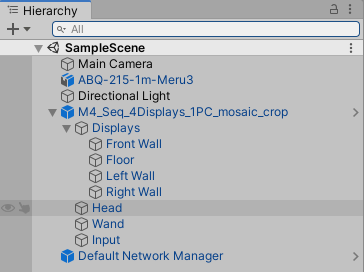

# Tutorial-Unity_with_UniCAVE

# Unity with UniCAVE

# Requirements

1. Unity 2019.3.5 version
2. Download UniCAVE plugin

    [https://widve.github.io/](https://widve.github.io/UniCAVE/pages/downloads.html)

3. Download UniCAVE 2019 on CAVE machine

# Unity Project setup

## Import package

Go to Package→UniCAVE Plugin→Prefabs, drag and drop `Default Network Manager` to the scene.

Import the prefab file below

[M4_Seq_4Displays_1PC_mosaic_crop.prefab](sources/M4_Seq_4Displays_1PC_mosaic_crop.prefab)

Now, the scene is like:



## Display, Head, Wand, Input Setup

### Display

Go to Assets area, right click and create new `MachineName Assets` and set name as VISCUBE


Also set the name here


1. Select Displays under `M4_Seq_4Displays_1PC_mosaic_crop` → `Displays`
2. Go to Inspector

    

3. Create `Physical Display Manager` and se machine Name as the `MachineName Asset` 

    Associated Displays will be setup automatically once the different displays setup.

4. Select Front Wall and go to Inspector

    

    Add Component `Physical Display` and select Manager as `Displays`

    For the Head, once setup `Head`, then go back to here to set Head

    For other values, we can import them from JSON files.

    [Display_settings.zip](sources/Display_settings.zip)

    Do the same thing for `Floor`, `Left Wall`, and `Right Wall`

5. Go to Head

    

    set the value as the image above.

6. Go to Wand

    Remove the empty script (otherwise, it may cause the frozen.)

    Add a new component `VRPN Track` and change `Tracker Address` and `Channel` =1

7. Go to Input

    remove empty script, create `VRPN Input`, and set as below

    

    For other features, free to change.

8. Go to `Default Network Manager` , and add `Network Initialization`

    

    Remember to change Server Address to **192.168.0.2**

### Change Clipping Panel

Go to `M4_Seq_4Displays_1PC_mosaic_crop` → `Head`

Change the Far Clipping Plane to 1000000 (a big number)

### Add VR Support

Go to Edit → Project Settings → Player

Under XR Settings enable `Virtual Reality Supported`

Add Stereo Display (non head-mounted) to SDK

Remove others SDKs

### Edit VRPN script

Go to Packages → UniCAVE Plugin → Scripts → VRPN

Edit VRPN.CS file

Replace the following code

```csharp
//todo - need to allow different transforms here...
//need to adjust two below functions to match up with your own tracking system's transform
public static Vector3 vrpnTrackerPos(string address, int channel)
{
    return new Vector3(
				(float)vrpnTrackerExtern(address, channel, 0, Time.frameCount),
        (float)vrpnTrackerExtern(address, channel, 1, Time.frameCount),
        -(float)vrpnTrackerExtern(address, channel, 2, Time.frameCount));
}

public static Quaternion vrpnTrackerQuat(string address, int channel)
{
    return new Quaternion(
				(float)vrpnTrackerExtern(address, channel, 3, Time.frameCount),
        (float)vrpnTrackerExtern(address, channel, 4, Time.frameCount),
        -(float)vrpnTrackerExtern(address, channel, 5, Time.frameCount),
        -(float)vrpnTrackerExtern(address, channel, 6, Time.frameCount));
}
```

### Build

After setup, go to File → Build Setting..., and build it. and save it to a USB

# Run the project - CAVE Machine

1. Turn on the Projector by double click PROJS_ON.sh
2. Open DTrack2, connect
3. Turn on `VRPN Server`
    1. go to folder on Desktop/visbox/apps/UniCAVE2019
    2. double click `vrpn_server.exe`
4. Copy the project folder to  /UniCAVE2019
5. Copy the `paul2019_force_gpu.ps1` to the project folder
6. Edit the `ps1` file
    1. Change the executable file to the unity project exe file.
    2. Change the name of the log file